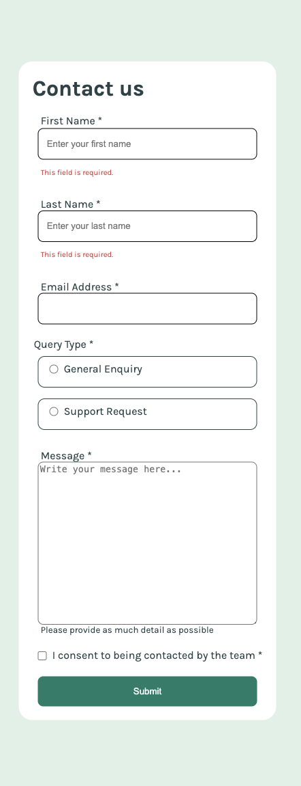
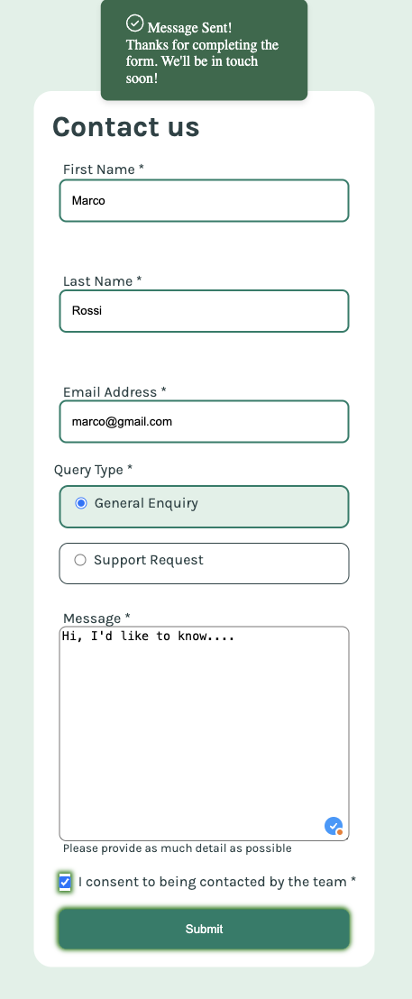
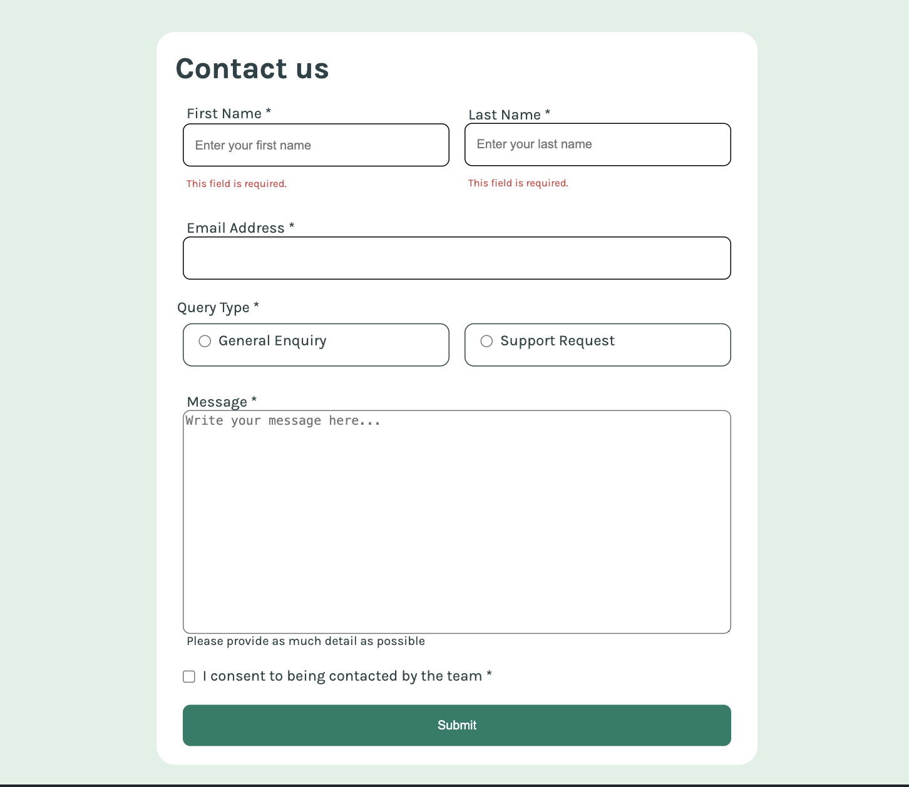

# Frontend Mentor - Contact form solution

This is a solution to the [Contact form challenge on Frontend Mentor](https://www.frontendmentor.io/challenges/contact-form--G-hYlqKJj). Frontend Mentor challenges help you improve your coding skills by building realistic projects. 


## Table of contents

- [Overview](#overview)
  - [The challenge](#the-challenge)
  - [Screenshot](#screenshot)
  - [Links](#links)
- [My process](#my-process)
  - [Built with](#built-with)
  - [What I learned](#what-i-learned)
  - [Useful resources](#useful-resources)
- [Author](#author)


## Overview

### The challenge

Users should be able to:

- Complete the form and see a success toast message upon successful submission
- Receive form validation messages if:
  - A required field has been missed
  - The email address is not formatted correctly
- Complete the form only using their keyboard
- Have inputs, error messages, and the success message announced on their screen reader
- View the optimal layout for the interface depending on their device's screen size
- See hover and focus states for all interactive elements on the page

### Screenshot






### Links

- Live Site URL: [See the Live Site here](https://responsive-contactform.netlify.app/)


## My process

### Built with

I chose this challenge to build it with the CSS Grid, so to get familiar with the model. I used:

- Semantic HTML5 markup
- CSS Grid
- Flexbox
- Mobile-first workflow
- JavaScript function to give different background to selected elements


### What I learned

1) CSS Grid responsive workflow

I followed a responsive mobile-first approach while styling this contact form with CSS Grid: 

- I assigned an initial "1 column grid layout" to the form (the parent element), to allow each child to stretch into its own row when on mobile screens.

- I created a media query for tablets and laptops (min-width: 769px) and changed the grid layout of the form to "1fr 1fr", that is to say "two identical columns". I then assigned the "span 2" property to the children who had to occupy the entire row, and, on the other hand, I assigned a "span 1" property to those children who had to stay just in one column of the two. I matched "span 1" property with "grid-column-start: 1" and "green-column-end: 2" adjust proportions, making adjacent children stay in exactly one half of their row.

```css
/* mobile screen */
form {
    display: inline-grid;
    grid-template-rows: auto;
    grid-template-columns: 1fr;
    row-gap: 1.25rem;
  }

  then =>

/* tablets and laptops screen */
  @media screen and (min-width:769px) {
    form {
        width: 37.5rem;
        grid-template-columns: 1fr 1fr;
    }

    .zero, .three, .four, .five, .six, .seven {
        grid-column-start: 1;
        grid-column-end: 2;
        grid-column: span 2;
    }
  }
```

2) JavaScript function to change the background color of the radio buttons' containers when selected.
```js
function addGreenBgtoGeneral() {
    if(GENERAL_BTN.checked) {
        GENERAL_BTN_CONTAINER.classList.add("green");
        SUPPORT_BTN_CONTAINER.classList.remove("green");
        console.clear();
        console.log(`${GENERAL_BTN.id} is checked.`);
        console.log(`${SUPPORT_BTN.id} isn't checked.`)
    }
}
```

3) JavaScript function to display a popup message when the form gets submitted: this was interesting as I first added a ".show" class to the popup msg in order to make it visible, then I also had to adjust the animation effect it appeared / desappeared with.

```js
POPUP.classList.add("show"); // Show popup msg
```
then =>

```css
  #success_msg.show {
      display: flex;
      animation: fadeInOut 5s ease forwards;
  }
  
@keyframes fadeInOut {
    0% { opacity: 0; }
    10%, 90% { opacity: 1; }
    100% { opacity: 0; }
}

```


### Useful resources

- [CSS Grid Layout Guide](https://css-tricks.com/snippets/css/complete-guide-grid/) - This helped me studying how the GRID layout works.

## Author

- Follow me on GitHub - [Add your name here](https://www.your-site.com)
- My Frontend Mentor profile - [@yourusername](https://www.frontendmentor.io/profile/yourusername)
- Linkedin - [@yourusername](https://www.twitter.com/yourusername)

